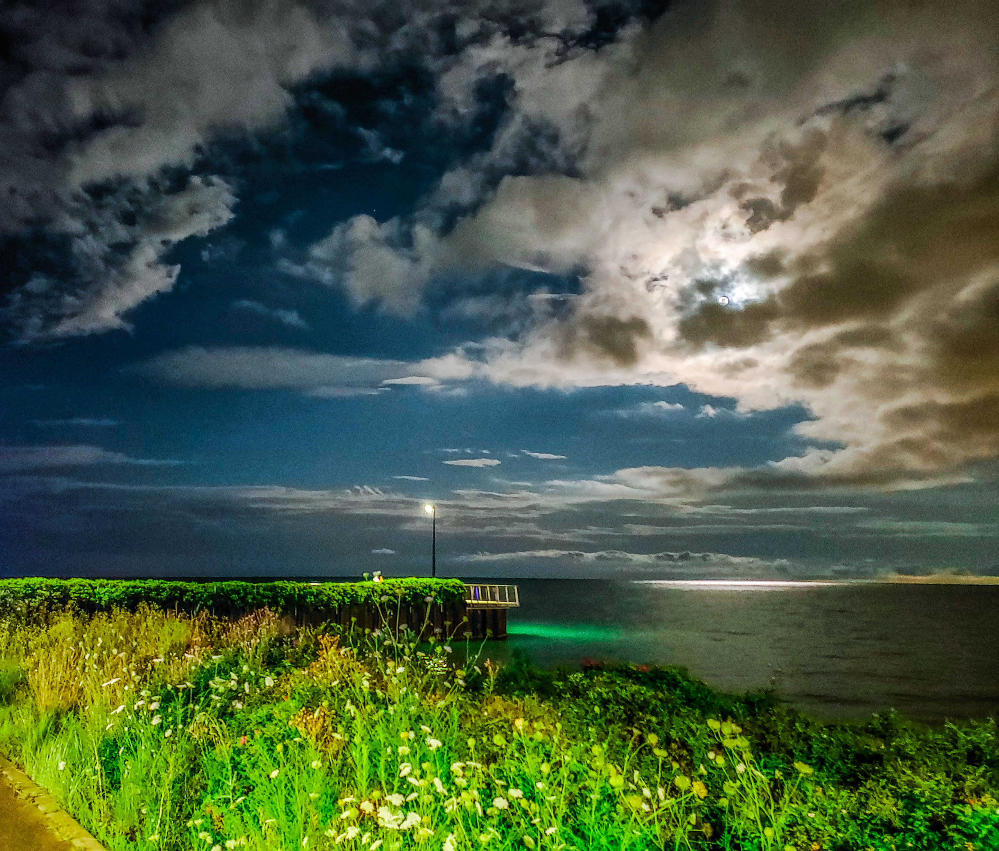
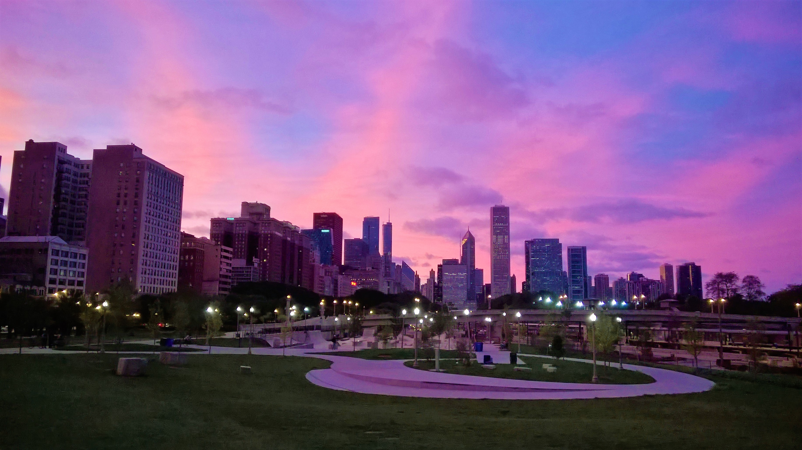

Rob is a genomicist and bioinformatician with an extensive background in microbial genomics, psychiatric genomics, and an ever increasing knowledge of human population genomics. To accomplish all that he has developed an array of computational skills, case in point: this website. In his free time, Rob spends a large quatity of time outdoors, exploring Chicago on foot or by pedal.  

The disqus comment section is disabled as this isn't intended to be a blog per se. If you have questions about the work here, or there is something wrong, you can politely let me know. Science is the process of being [wrong](https://blogs.scientificamerican.com/guest-blog/the-key-to-science-and-life-is-being-wrong/), hopefully in the right direction.  

